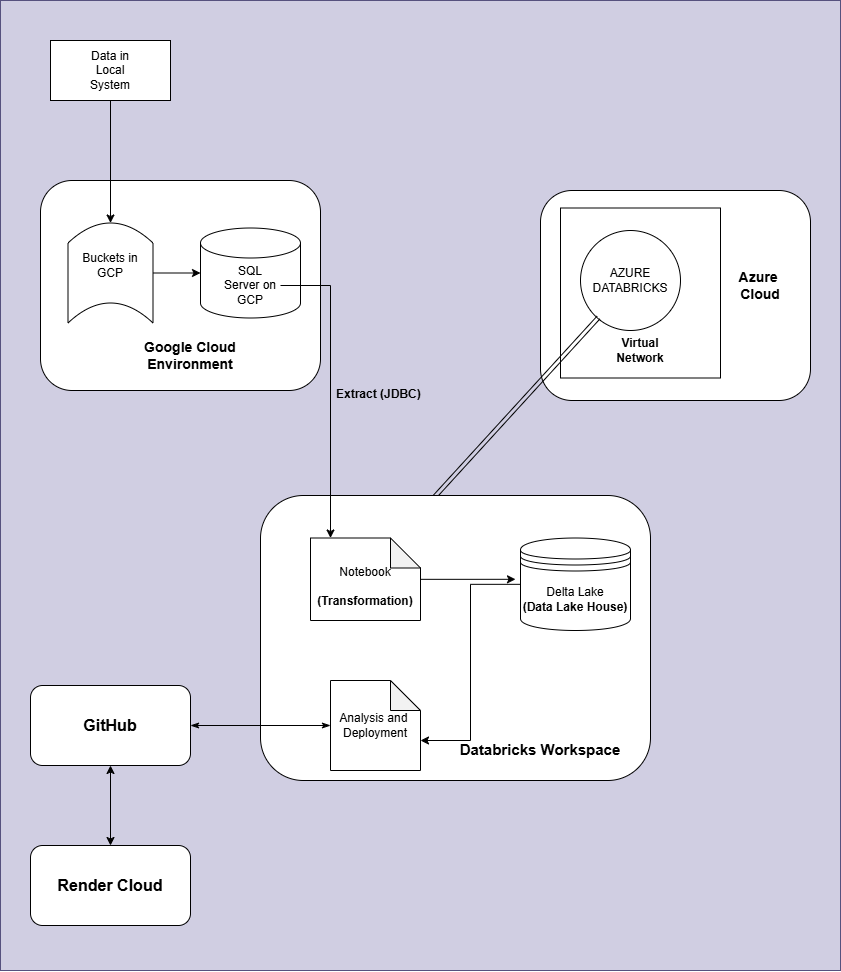

# Cloud Data Pipeline Architecture

**Deployed at:** [https://nlpproject-pl6e.onrender.com/](https://nlpproject-pl6e.onrender.com/)

**Demo at:** [Video Demo](https://drive.google.com/file/d/1oFGXaLMhgJY7y8OKO4hEWjZIrAAFM5Ly/view?usp=drive_link)

**Some Other Files:** [Other Files]()

## **Overview**

This pipeline integrates various cloud platforms and tools to enable efficient data processing and analysis. It is designed for seamless data transfer, transformation, and deployment for advanced analytics.

---

## **Architecture Diagram**



The diagram illustrates the complete architecture, including data flow and integration between various platforms.

---

## **Components**

### **1. Data Source**
- **Local System**: Raw data originates from a local system, which is then uploaded to GCP.

---

### **2. Google Cloud Environment**
- **Buckets in GCP**: Data is stored in GCP buckets for initial processing and staging.
- **SQL Server on GCP**: Structured data is stored and managed using SQL Server hosted on GCP.
- **JDBC Extraction**: Data is extracted from the SQL server using JDBC for further processing.

---

### **3. Azure Cloud**
- **Azure Databricks**: Data processing and transformation are performed on Azure Databricks, hosted within a secure Virtual Network.

---

### **4. Databricks Workspace**
- **Notebook (Transformation)**: Data is transformed using Databricks Notebooks, which apply advanced processing and preparation logic.
- **Delta Lake (Data Lake House)**: The processed data is stored in Delta Lake for efficient querying, updates, and management.
- **Analysis and Deployment**: Analytical models are developed, tested, and deployed for end-use.

---

### **5. GitHub**
- The codebase and notebooks used for data processing and analytics are version-controlled and stored in GitHub.

---

### **6. Render Cloud**
- Final analysis and deployments are pushed to the Render Cloud, enabling integration with end-user applications and services.

---

## **Workflow**

1. **Data Ingestion**: Raw data is uploaded from the local system to GCP buckets.
2. **Data Storage**: Data is structured and stored in an SQL Server on GCP.
3. **Data Extraction**: Using JDBC, the data is extracted from the SQL Server to the Databricks Workspace.
4. **Data Transformation**: Transformation and data wrangling are conducted in Databricks Notebooks.
5. **Data Storage in Delta Lake**: Transformed data is stored in Delta Lake, enabling a lakehouse architecture.
6. **Analytics and Deployment**: The processed data is analyzed, and results are deployed for further use.
7. **Version Control**: All code and notebooks are maintained in GitHub.
8. **App Creation** : A streamlit app is created.
9. **Final Deployment**: App is deployed to the Render Cloud for accessibility and integration.

---

## **Technologies Used**

- **Google Cloud Platform**: Data storage and SQL server hosting.
- **Azure Databricks**: Data processing and transformation.
- **Delta Lake**: Efficient storage and querying.
- **GitHub**: Version control for development and collaboration.
- **Render Cloud**: Final deployment for application integration.
- **Backend and Frontend**: Streamlit


## Getting Started

### Prerequisites
- Python 3.11 used
- Setup of Pipeline as per architecture

### Installation
1. **Clone the repository**:
   ```bash
   git clone https://github.com/codingmukul/data_mining_project
   cd data_mining_project
   ```

2. **Install dependencies**:
   ```bash
   pip install -r requirements.txt
   ```

3. **Run the Streamlit app**:
   ```bash
   streamlit run app.py
   ```

5. **Access the Application**:
   Open your browser and navigate to `http://localhost:5000`.

## Usage
- **Algorithm Findings**: To find the association rules given the minimum values of support, confidence and lift.
- **Plots and Analysis**: Some important plots related to data.


---
