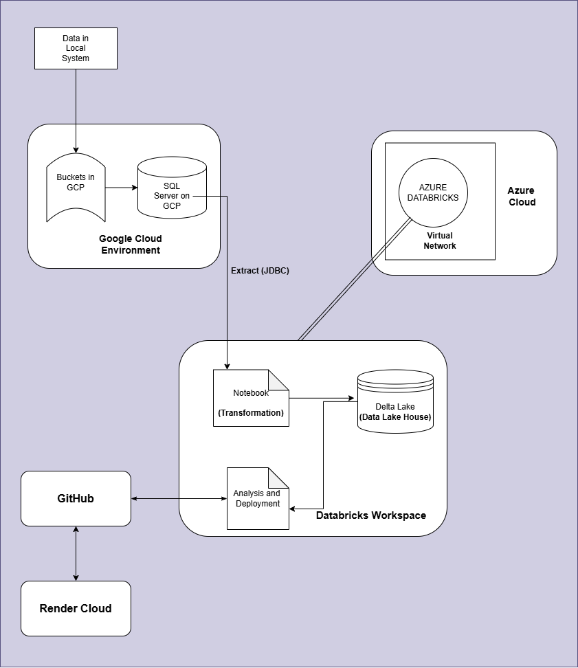

### **Grocery Data Analysis with Cloud Data Pipeline**

Created By: Mukul Aggarwal 

MSD23007 (IIITL)

---

### **Deployment and Demonstration**
- **Deployed At:** [Data Mining Project on Render](https://dataminingproject-2lpg.onrender.com/)
- **Demo Video:** [View Here](https://drive.google.com/file/d/1-UPkYLRttOJ-jgy-78Voz2wV9TB2OQ9z/view?usp=sharing)

---

### **Overview**

This project implements a cloud-based data pipeline that processes, transforms, and analyzes data to derive actionable insights. The pipeline integrates Google Cloud Platform (GCP), Azure Databricks, Delta Lake, and Render Cloud for hosting and deployment. Its primary focus is on utilizing algorithms for frequent itemset mining and generating association rules using Apriori and FP-growth methods, forming the core of the data processing and analysis framework

---

### **Architecture**

The above diagram depicts the data pipeline's architecture, showcasing the flow from raw data ingestion to final deployment.

---

### **Pipeline Components**

#### **1. Data Source**
- **Origin:** Data is uploaded from a local system into GCP buckets for staging and initial processing.

#### **2. Google Cloud Platform**
- **Buckets:** Store raw and processed data temporarily.
- **SQL Server:** Houses structured data, enabling efficient management and querying.
- **JDBC Extraction:** Facilitates seamless data extraction to the Azure environment.

#### **3. Azure Databricks**
- **Databricks Workspace:** Utilized for advanced data ETL and analysis .
- **Delta Lake:** Acts as a data lakehouse for storing transformed data, enabling efficient querying and updates.

#### **4. GitHub**
- **Version Control:** Houses the codebase and notebooks, ensuring collaborative development.

#### **5. Render Cloud**
- **Deployment:** Final analytics and application are hosted here for end-user access.

#### **6. Application Layer**
- **Streamlit:** A web-based app built for visualizing and interacting with the data analysis.

---

### **Workflow**

#### **Step-by-Step Process**

1. **Data Ingestion:** Raw data uploaded to GCP buckets.
2. **Data Storage:** Data is stored in a structured format using SQL Server on GCP.
3. **Data Extraction:** JDBC extraction pulls data from SQL Server to Azure Databricks.
4. **Data Transformation:** Advanced transformations and wrangling performed using Databricks Notebooks.
5. **Storage in Delta Lake:** Transformed data stored for querying and analysis.
6. **Analysis and Algorithms:** Data Analysis is done and algorithms like apriori and fp-growth are used to find frequent item datasets and association rules.
7. **Application Development:** Interactive Streamlit application built for visualization.
8. **Deployment:** Application deployed on Render Cloud for accessibility.

---

### **Analysis Report: Grocery Data and Association Rules**

#### **1. Dataset Summary**
- **Fields:** `Member_number`, `Date`, `itemDescription`, `Year`, `Month`, `Day`, `WeekOfYear`.
- **Transaction Timeline:** Covers two years of data (2014–2015).
- **Unique Items:** 167 grocery items.

---

#### **2. Key Insights**

##### **Items Sold Analysis**
- **Yearly Trends:** Increased sales in 2015 compared to 2014.
- **Popular Items:**  
  1. Whole Milk (2502 sales)  
  2. Other Vegetables (1898 sales)  
  3. Rolls/Buns (1716 sales)  

##### **Customer Behavior**
- Most transactions involve a small number of items.
- Assumption: Customers make a single purchase per day.

---

#### **3. Association Rule Mining**

##### **Apriori Algorithm**
- **Rules Generated:** 99
- **Notable Rule:** *(Whole Milk, Yogurt) → Sausage*  
  - **Support:** 0.006  
  - **Confidence:** 25.58%  
  - **Lift:** 2.18  

##### **FP-Growth Algorithm**
- **Rules Generated:** 130
- Similar insights to Apriori, with additional associations.

##### **Visualization**
- Plots of support vs. confidence highlight sparse but significant associations.

---

#### **4. Technologies and Tools**
- **Data Platforms:** GCP, Azure Databricks, Delta Lake.
- **Languages and Frameworks:** Python, Streamlit.
- **Version Control:** GitHub.
- **Deployment:** Render Cloud.

---

### **Concluding Remarks**

The pipeline provides a robust framework for analyzing data through efficient cloud-based integrations. Grocery data analysis reveals insightful purchasing patterns, although low support values in association rules require careful interpretation. The deployed application offers a seamless user experience for exploring data insights.
